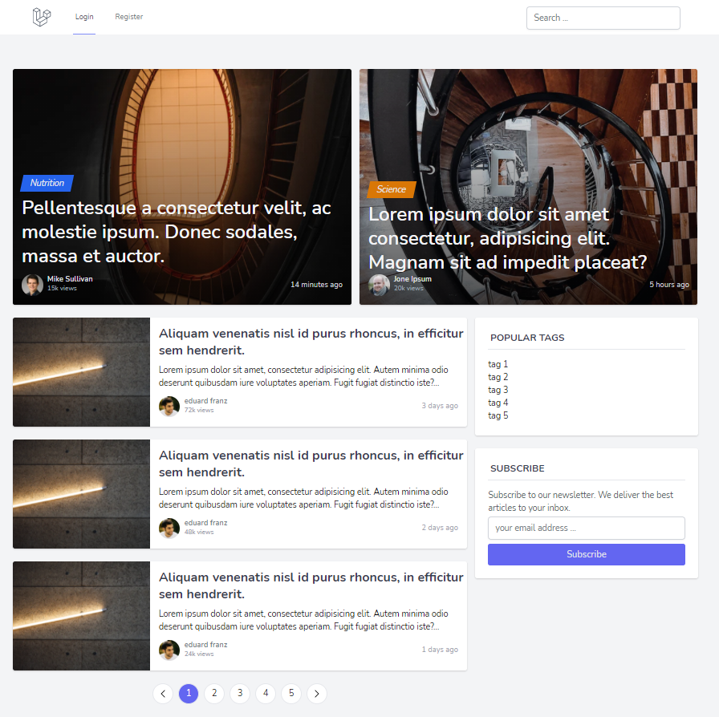

## 💎 Features

- Authentication/Authorization
- CRUD Tags
- CRUD Comments
- CRUD Static Pages
- CRUD Posts
- Search / Filter

## 😎 Involved Technologies

- Framework: Laravel 8
- Language: PHP
- Databases: MySql, ElistcSearch, Redis
- Front-end: Alpine.js / Tailwind css
- Assets Pipeline: Webpack(Laravel Mix)
- Proxy: Nginx + php-fpm

## 🤔 How to install this project locally ?
1. make sure to install `PHP` and composer(PHP package manager)
2. run `git clone https://github.com/W2AlharbiMe/laravel-blog`
3. run `cd laravel-blog && composer install && npm install` note: you can use `yarn` instead of `NPM`
4. rename `.env.example` to `.env`
5. make sure to configure mysql in `.env` 
6. run `php artisan migrate` (if you get any error make sure your database is configured correctly)
7. run `php artisan key:generate`
8. run `php artisan serve`
9. visit `http://127.0.0.1:8000`

